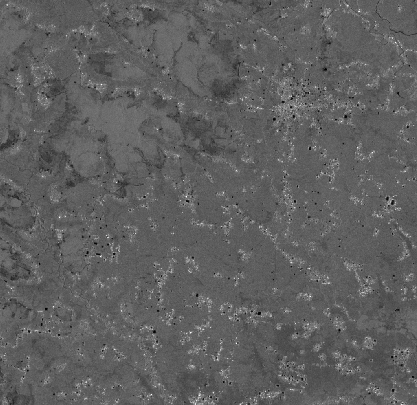
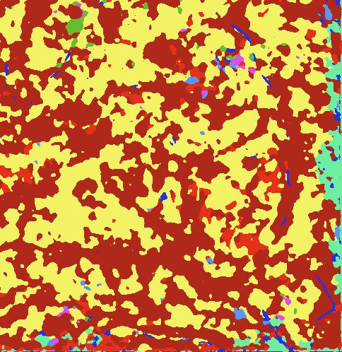

# Sentinel-1 SAR GRD: C-band Synthetic Aperture Radar Ground Range Detected Segmentation

## Testing the model's accuracy :

Here are some of the training images and the model's predicted ouptuts.

|    Satellite Images    | Predicted outputs  |     Ground Truths     |
| :--------------------: | :----------------: | :-------------------: |
|   |   |   |
|  |  |  |
|  |  |  |

## Plots

The dataset comprised of 17844 training images and 1801 validation images, each of 128 \* 128 pixels. The model was trained for 30 epochs.
A training accuracy of about 93% was obtained and a validation accuracy of about 65%.

|            Accuracy Plot             |            Loss Plot             |
| :----------------------------------: | :------------------------------: |
|  |  |

## Change Detection

Some of the segmented images over a period of time.

|          Jan-March          |           April-June           |           July-Sept            |           Oct-Dec            |
| :-------------------------: | :-------------------------: | :-------------------------: | :-------------------------: | :-------------------------: | :-------------------------: |
|   |   |   |   
|  |  |  | 
|  |   | |  
|  |  |  | 
|  |  |  | 

Here are the pre-trained weights, ([download weights](https://drive.google.com/file/d/13dyzByX94_a8iqIy7UBuSI3eIAMuxPqp/view?usp=sharing))
